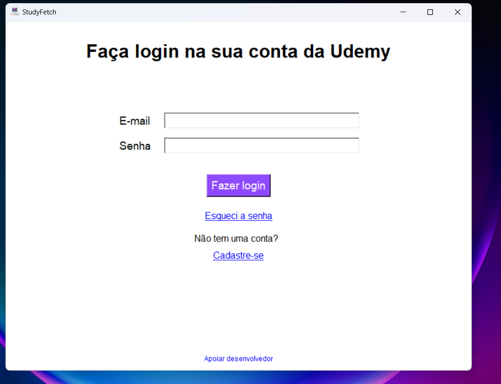
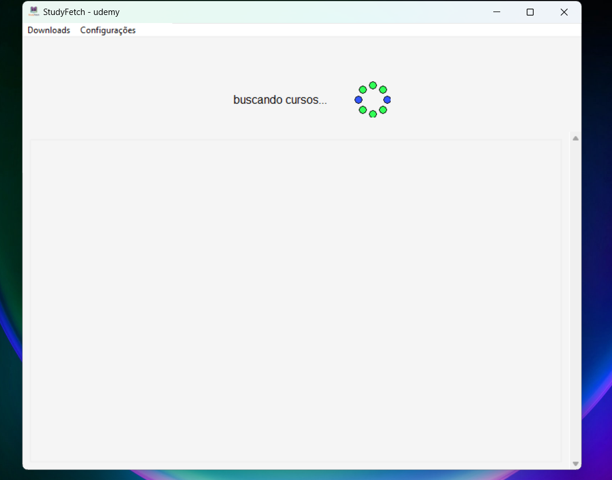
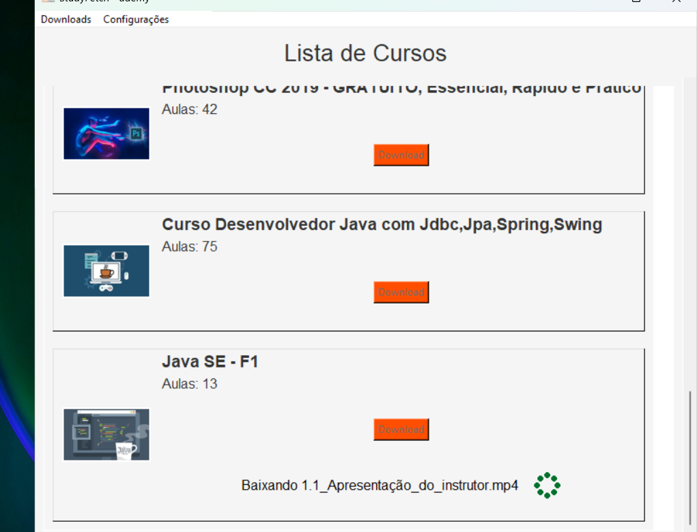
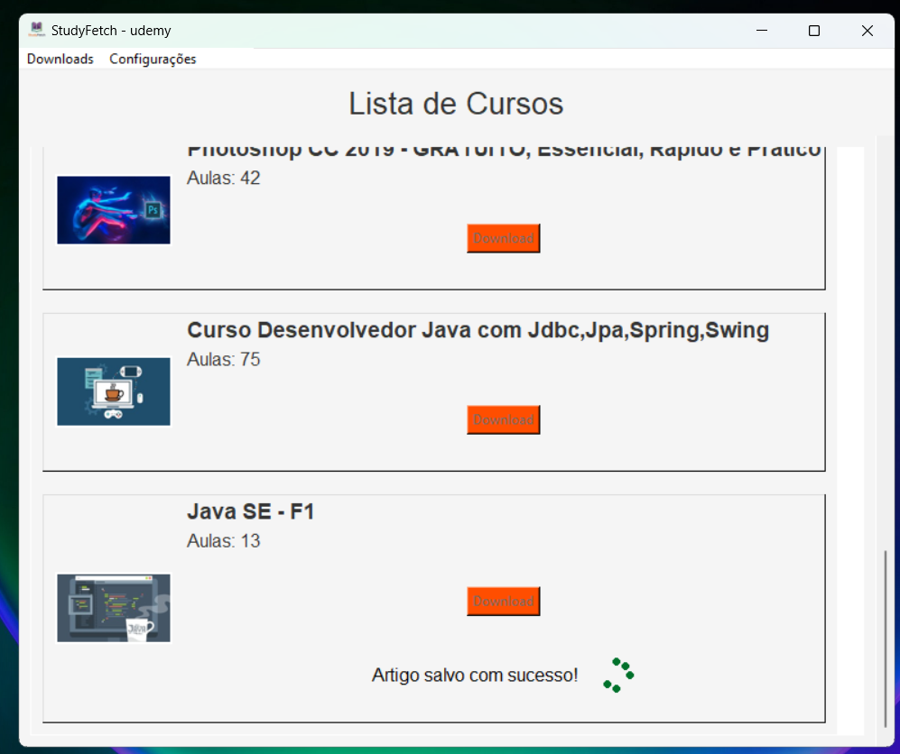

# Baixar cursos na plataforma udemy

 

é uma aplicação desktop eficiente que permite baixar cursos das plataformas **Udemy**
para estudo offline. Com uma interface simples e amigável.

## 📜 Funcionalidades

- 🌐 **Suporte a plataformas**: Udemy.
- 📥 **Download de cursos**: Baixe cursos inteiros diretamente para o seu dispositivo.
- 🚀 **Interface simples**: Fácil de usar, sem complicações.

## 🚀 Instalação

1. Baixe a versão compilada mais recente **[versões](versions)**

2. Execute o instalador e siga as instruções na tela.

3. Após a instalação, abra o **StudyFetch**,realize login em sua conta e comece a baixar seus cursos!

**StudyFetch** - *Seu conhecimento, suas regras.*

---